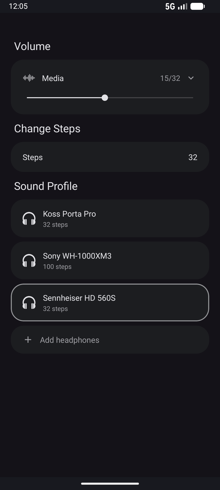
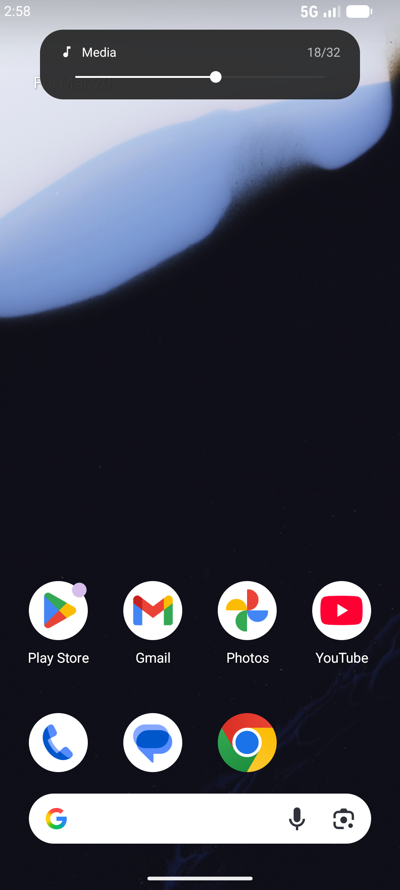
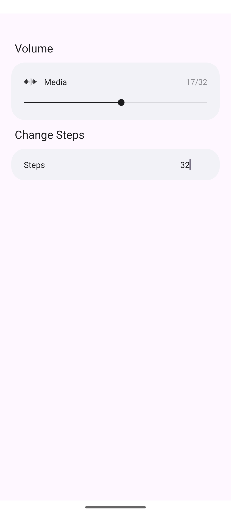
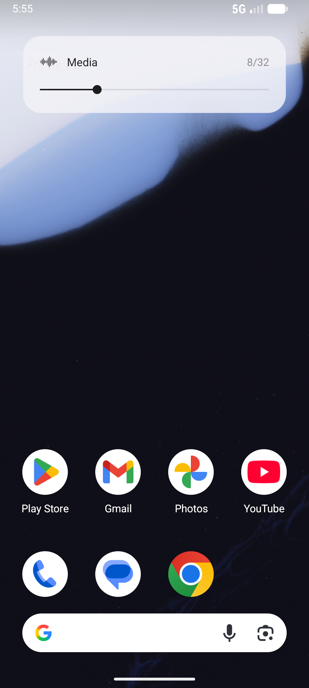

# 32steps

Override Android's default volume steps. Set your own custom step count (1-1000). No root required. Includes 6000+ headphone sound profiles from [AutoEQ](https://github.com/jaakkopasanen/AutoEq), updated automatically.

  
  
  
  

## How it works

Android defaults to 15-25 volume steps. 32steps lets you set your own count by splitting each system step into smaller sub-steps using a gain offset through Android's DynamicsProcessing API (falls back to Equalizer on older devices). An accessibility service intercepts your volume buttons, and a foreground service keeps it running in the background. Works across all apps.

## Sound Profiles

Pick your headphones from 6000+ models and the app corrects the sound based on measured data from AutoEQ. Save presets with different headphones and step counts. The headphone database updates automatically.

## Requirements

- Android 8+

## Setup

1. Install the APK
2. Open the app, set your preferred number of steps
3. Follow the guided setup (accessibility service, overlay, battery)
4. Close the app and use your volume buttons

## Permissions

- **Accessibility Service** - intercepts volume button presses
- **Overlay** - shows volume popup when you change volume
- **No internet** - the app can't send or receive any data

On Android 13+, you may need to allow restricted settings first. Go to **Settings > Apps > 32steps**, tap the three dots in the top right corner, then tap **Allow restricted settings**.

## Download

Available on [Droid-ify](https://github.com/Droid-ify/client) and [Neo Store](https://github.com/NeoApplications/Neo-Store) (IzzyOnDroid repo is pre-configured), or add the [IzzyOnDroid repo](https://apt.izzysoft.de/fdroid/repo) to the F-Droid client.

You can also grab the APK directly from the [Releases](https://github.com/nulldio/32steps/releases) page.

## Building from source

1. Open the project in Android Studio
2. **Build > Select Build Variant > release**
3. **Build > Generate App Bundles or APKs > Build APK**

## License

MIT
